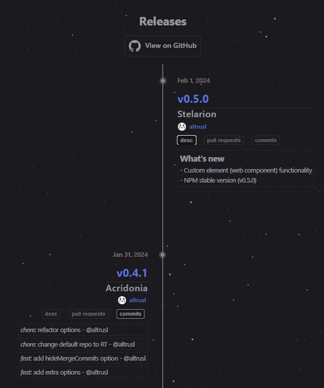

# GitHub release timeline

Visualization on GitHub releases for any public and private repository.



## Documentation

## [https://vue-faq.org/ru/release-timeline/](https://vue-faq.org/ru/release-timeline/)

## Installation

```bash [pnpm]
pnpm add release-timeline
```

In your code:

```vue
<script setup>
import { ReleaseTimeline, DefaultOptions as options } from "release-timeline";
import "release-timeline/dist/style.css";
// import "release-timeline/dist/animated-background.css";

options.github.owner = "vuesence";
options.github.repo = "arty-crafty";
</script>

<ReleaseTimeline :options="options" />
```

Importing of the `animated-background.css` is optional. Be aware, the starred background CSS takes 70Kb.

## Contributors

🚀 If you have any ideas for development of optimization of `release-timeline`, feel free to open [issues](https://github.com/vuesence/release-timeline/issues) or [pull requests](https://github.com/vuesence/release-timeline/pulls).
